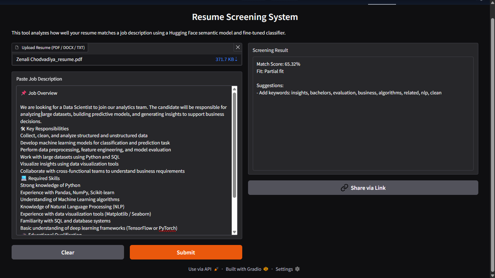

📌 NLP-Based Resume Screening System
📖 About the Project

This project is an NLP-based Resume Screening System that evaluates how well a candidate’s resume matches a given job description.

Job applicants often struggle to understand whether their resume aligns with the requirements of a specific role. At the same time, recruiters spend significant time manually reviewing and shortlisting resumes. This system addresses both challenges by using Natural Language Processing techniques to analyze resume content and compare it with job descriptions.

The system predicts the most suitable job category for a resume and calculates a match score to show how closely it fits a specific job role.

🎯 What This System Does

Accepts resumes in PDF, DOCX, or TXT format
Cleans and processes resume text using NLP techniques
Classifies resumes into one of 25 job categories
Compares resume content with job descriptions
Calculates a similarity match percentage
Displays results through an interactive interface

🛠 Technologies Used

Python
Natural Language Processing (NLP)
NLTK and SpaCy for text preprocessing
TF-IDF for feature extraction
Machine Learning models (Logistic Regression / SVM / Random Forest)
Cosine Similarity for resume-job matching
Transformer models (DistilBERT / SentenceTransformer)
Scikit-learn for training and evaluation
Gradio for user interface

⚙️ How the System Works

1️⃣ Text Preprocessing

The resume text is first cleaned and standardized by:
Converting text to lowercase
Removing special characters and punctuation
Removing stopwords
Tokenizing the text
Applying lemmatization

This step ensures that the data is structured and ready for analysis.

2️⃣ Feature Extraction

The processed text is converted into numerical format using:
TF-IDF vectorization
or
Transformer-based embeddings for capturing contextual meaning

3️⃣ Resume Classification

The system predicts the job category of the resume, such as Data Science, HR, Web Developer, Mechanical Engineer, and others.
Dataset details:
962 resumes
25 job categories

4️⃣ Resume–Job Matching

The resume and job description are compared using cosine similarity and semantic similarity techniques.

The system generates:
Match percentage score
Predicted job role
Final recommendation

📊 Model Performance

The model was evaluated using the following metrics:

Accuracy
Precision
Recall
F1-Score

The system performs well for clearly defined job categories like Java Developer, Mechanical Engineer, and Health & Fitness. Some overlap is observed between closely related roles, but overall the performance remains consistent and reliable.
## 📸 Project Output

🔮 Future Improvements

Improve dataset balance
Further fine-tune transformer models
Deploy as a full web application
Develop a recruiter dashboard

👨‍💻 Contributors

Zenali Chodvadiya
Priyashha Gulati
Anubha Jhanwar
